# TouchRTKStation

## 概要
* 誰でも簡単に利用できる一周波RTK-GNSSの基準局，移動局
* 一周波GNSSアンテナ・受信機 + RTKLIB + RaspberryPi + タッチスクリーン + ケース + GUI


## 機能
* **基準局（Base）**
  * GNSS RawデータをUSBメモリに保存
  * TCP Server, Ntrip Server, Ntrip Casterで観測データを配信
  * ZigBeeなどの無線モジュールにも対応  

* **移動局（Rover）**
  * GNSS Rawデータ，測位結果をUSBメモリに保存
  * 単独測位，Kinematic RTK-GNSS，Static RTK-GNSSに対応

## 特徴
* GNSSのライブラリとして [RTKLIB](https://github.com/tomojitakasu/RTKLIB) を使用
* TouchRTKStationは [RTKLIB_Touchscreen_GUI](https://github.com/Francklin2/RTKLIB_Touchscreen_GUI) にインスパイアされたものです．
* [RTKLIB_Touchscreen_GUI](https://github.com/Francklin2/RTKLIB_Touchscreen_GUI) と大きく異なる点は，
  * RTKLIBのAPP（rtkrcv，str2str）をそのまま呼び出して使用しているため，RTKLIBのアップデートをそのまま利用できる
  * PyQTを利用したPythonで書かれた単一のプログラムのため，拡張が容易
  * より小型 (5インチ (RTKLIB_Touchscreen_GUI) -> 4インチ (TouchRTKStation))

## 用意するもの

* **工具類**
  * はんだごて
  * ニッパー
  * ドライバー
* **部品類**  
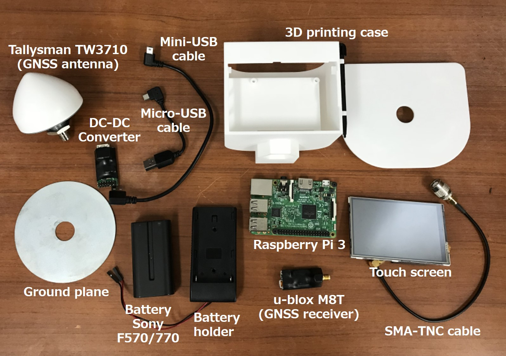<p>
  * **ケース:** 3Dプリンタで出力 (STLデータは[こちら](./3D))
    * 次のshopに出品しているので，下記から直接購入することもできます
      * [DMM.Make](https://make.dmm.com/shop/130606/)
      * [Shapeways](https://www.shapeways.com/shops/tarosuzuki)
  * **GNSS受信機:** u-blox M8T [CSG shop](http://www.csgshop.com/product.php?id_product=205)がおすすめ, mini-USBコネクタ
  * **mini-USBケーブル:** L字ショートケーブルがおすすめ 例：[Amazon](https://www.amazon.co.jp/gp/product/B06ZY6D16R/ref=oh_aui_detailpage_o06_s00?ie=UTF8&psc=1)
  * **GNSSアンテナ:** Tallysman TW3710 (GPS+GLO+BDS L1)がおすすめ [Digi-Key](http://www.digikey.fr/product-detail/fr/0/1526-1016-ND)
  * **Raspberry Pi 3:** [RSコンポーネンツ](https://jp.rs-online.com/web/p/processor-microcontroller-development-kits/1225826/)など
  * **micro SDカード:** Raspberry Pi用，16GB程度
  * **TNC(P)-SMA(J)変換コネクタ:** [Amazon](https://www.amazon.co.jp/uxcell-TNC%E3%82%AA%E3%82%B9%E2%86%92SMA%E3%83%A1%E3%82%B9-%E3%83%97%E3%83%A9%E3%82%B0%E3%82%B3%E3%83%8D%E3%82%AF%E3%82%BF%E3%83%BC-M-F-RF%E3%82%A2%E3%83%80%E3%83%97%E3%82%BF%E3%83%BC%E5%90%8C%E8%BB%B8%E3%82%B3%E3%83%8D%E3%82%AF%E3%82%BF-%E3%82%B9%E3%83%88%E3%83%AC%E3%83%BC%E3%83%88%E5%9E%8B-%E3%83%A1%E3%82%BF%E3%83%AB/dp/B012ACT4E8/ref=pd_lpo_vtph_tr_t_2?_encoding=UTF8&psc=1&refRID=2PS1F2028DF5KEXJPC8C)など
  * **SMA(P)-SMA(P)同軸ケーブル:** ショートケーブル [Amazon](https://www.amazon.co.jp/uxcell-a12091300ux0004-16CM-SMA%E3%82%AA%E3%82%B9-SMA%E3%82%AA%E3%82%B9%E5%9E%8B-%E3%82%B3%E3%83%8D%E3%82%AF%E3%82%BF%E3%83%94%E3%82%B0%E3%83%86%E3%83%BC%E3%83%AB%E3%82%B1%E3%83%BC%E3%83%96%E3%83%AB/dp/B00MFRWXFQ/ref=pd_sim_328_2?_encoding=UTF8&psc=1&refRID=G6YX66336CA8SBEPFPNV) など
  * **4inchディスプレイ:** Waveshare 4inch_RPi_LCD [Waveshare](https://www.waveshare.com/4inch-rpi-lcd-a.htm)など
  * **DC-DCコンバータモジュール:** Starawberry Linux LT8697 [Strawberry Linux](https://strawberry-linux.com/catalog/items?code=18697)
  * **micro-USBケーブル:** L字ショートケーブル [Amazon](https://www.amazon.co.jp/gp/product/B00H7YDMGG/ref=oh_aui_detailpage_o00_s00?ie=UTF8&psc=1)など
  * **バッテリーホルダー:** Lilliput Battery Plate for Sony Battery F-970 [Amazon](http://www.ebay.fr/itm/Battery-Adapter-Mounting-Plate-fr-NP-F970-F750-F550-Sony-Battery-970-DSLR-Rig-/172049210887?hash=item280eee9e07)など
  * **バッテリー:** Sony NP-F570(2900mAh) または NP-770(5000mAh)互換バッテリー [Amazon](https://www.amazon.co.jp/%E3%82%A2%E3%82%AF%E3%82%BB%E3%82%B5%E3%83%AA%E3%83%BC%E3%82%AD%E3%83%83%E3%83%88-%E5%85%85%E9%9B%BB%E3%82%AD%E3%83%83%E3%83%88%E5%AF%BE%E5%BF%9C%E6%A9%9F%E7%A8%AE-CCD-RV100-CCD-RV200-CCD-TR940/dp/B00WM75ROS/ref=sr_1_2_sspa?s=electronics&ie=UTF8&qid=1523510324&sr=1-2-spons&keywords=NP-F570&psc=1)など
  * **5/8インチナット:** ポール取り付け用 [MonotaRO](https://www.monotaro.com/p/0552/9307/)など
  * **グランドプレーン:** 10cm程度の金属板
  * **その他:** 熱収縮チューブ，はんだ，など

* **ソフトウェア**
  * [SD Card Formatter](https://www.sdcard.org/jp/downloads/formatter_4/)
  * [Win32Diskimager](https://sourceforge.net/projects/win32diskimager/)
  * (参考) Raspbian Image: [公式](https://www.raspberrypi.org/downloads/)
  * (参考) 4inchiディスプレイドライバ: [Waveshare](https://www.waveshare.com/wiki/4inch_RPi_LCD_\(A\))

## セットアップ
### Raspbianのインストール (PC上での作業)
  1. [RaspbianのImage](https://www.raspberrypi.org/downloads/)をダウンロード
  2. [SD Card Formatter](https://www.sdcard.org/jp/downloads/formatter_4/)などでSDカードをフォーマット
  3. [Win32Diskimager](https://sourceforge.net/projects/win32diskimager/)などで*.imgをmicro SDカードに書き込む

### TouchRTKStationのインストール
* TouchRTKStationのインストールには，Raspberry Pi3上でRaspbianを実行できるようにしておく必要がある
* Raspbian上で作業するためにHDMIケーブルでモニターとRaspberry Pi3を接続し，下記の手順でタッチスクリーンのドライバとTouchRTKStationをインストールをする

1. HDMIケーブルを用いてRaspberry Pi3とモニターをつなぐ．4インチディスプレイも接続しておく．
2. Raspberry Pi3を起動
3. ネットワークの設定　(省略)
4. TouchRTKStationのダウンロード  
`$ cd /home/pi/`    
`$ git clone https://github.com/taroz/TouchRTKStation.git`  
5. 設定用シェルスクリプトInstall.sh実行  
`$ cd /home/pi/TouchRTKStation/install`  
`$ sudo sh Install.sh`
6. Install.sh実行後、自動で再起動される
7. 4インチディスプレイに画面が出力されるようになる．HDMI出力に戻すには  
`$ cd LCD-show`  
`./LCD-hdmi`
8. TouchRTKStationの動作確認  
`$ sudo python3 /home/pi/TouchRTKStation/TouchRTKStation.py`
9. 動作確認したらTouchRTKStationを終了する  
（全画面表示になっているためCtrl+Alt+Dでデスクトップ表示，またはAlt+F4で終了）  
9. TouchRTKStation自動起動設定用シェルスクリプトAutostart.sh実行  
`$ cd /home/pi/TouchRTKStation/install`   
`$ sudo sh Autostart.sh`
10. 自動で再起動される
11. TouchRTKStation.py自動起動<p>   

### 組み立て手順
  1. [DC-DCコンバータ](https://strawberry-linux.com/catalog/items?code=18697)の作成  
    説明書に従いはんだ付けを行う．説明書ではケーブル保証抵抗が実装されているが，今回用いるケーブルは十分短いため必ずしも実装する必要ない．DC-DCコンバータ，受信機などはショートしないように固定するか，熱収縮チューブなどで絶縁したほうが良い<p>
  2. バッテリーマウントの改造
      * 四方のねじを外しカバーを開ける．  
      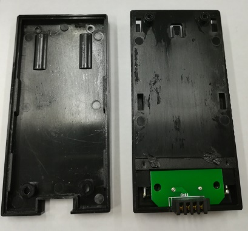<p>  
      * ケーブルを切断，基盤を外して電源ケーブルをはんだ付けする．  
      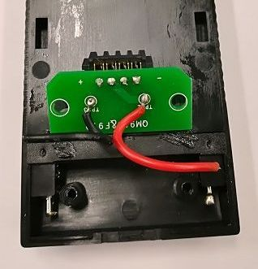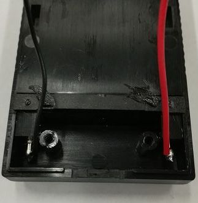<p>  
      * カバーを戻す.  
      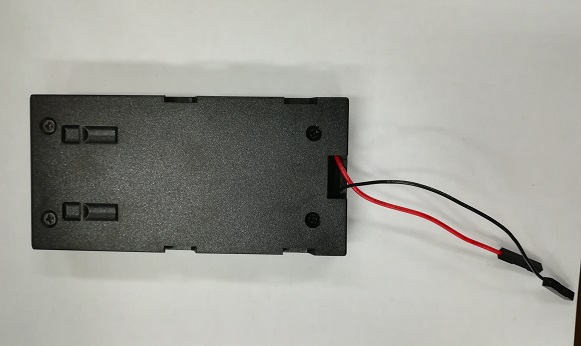<p>  
  3. 全体の組み立て
      * ポール取り付け用の5/8インチナットをケースにはめ込む  
      * バッテリーマウントをケースに装着し，DC-DCコンバータを接続する．  
      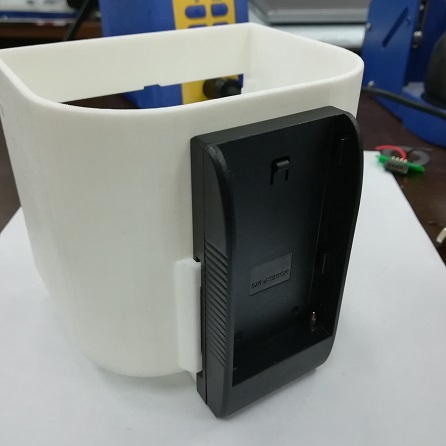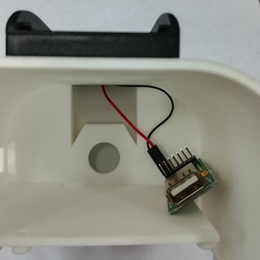<p>  
      * Raspberry PiにmicroSDカードを差し込む  
      * Raspberry Piをケースにねじ止めする．  
      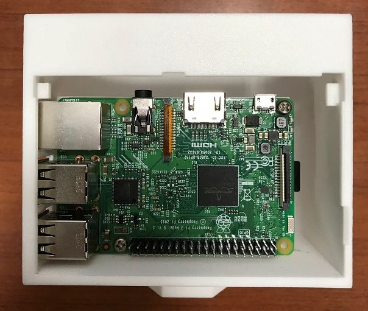<p>  
      * Tallysmanアンテナを組み立てる.  
      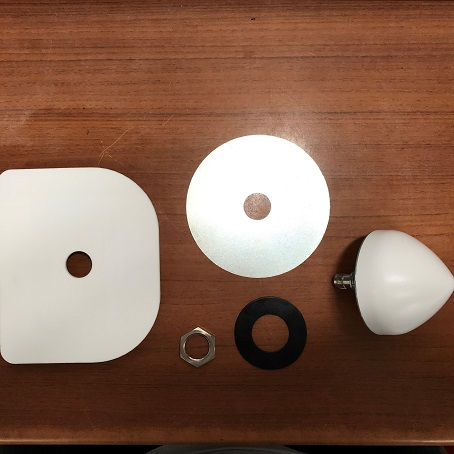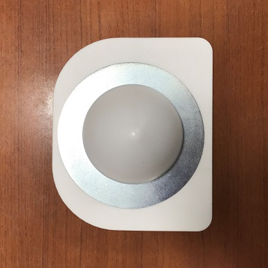<p>  
      * ケーブルをつなぐ.  
      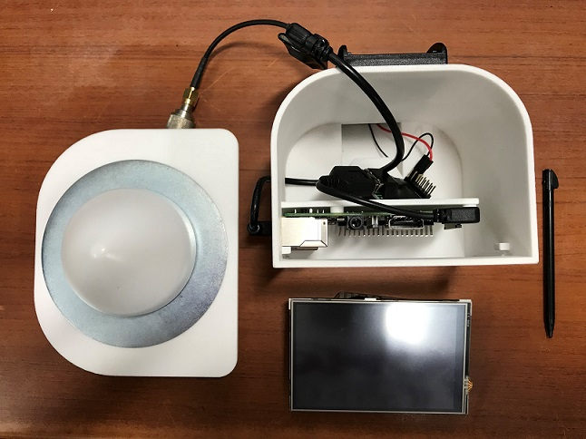<p>  
      * LCDを取り付け，アンテナをはめ込む．  
      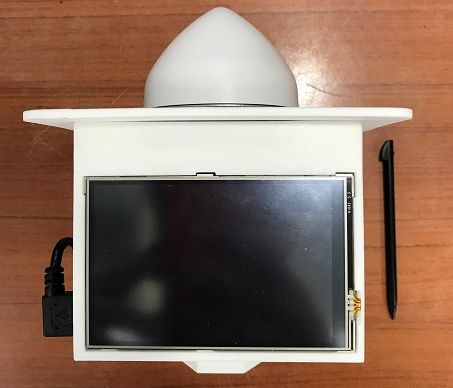<p>  

## 使い方
### 事前準備
* USBメモリをRaspberryPiのUSBポートに挿入．実行時にUSBメモリにGNSS Rawデータ(.ubx)が保存される．Roverモードの場合には，加えて測位結果(.posファイル)が保存される．USBメモリがない場合には，RaspberryPi内のhomeディレクトリに保存される．
* RoverモードでRTKをする場合またはBaseモードで補正データを配信する場合には無線LAN，またはUSBドングルなどでネットワークに接続する，またはZigBeeなどのシリアルポートとして認識されるUSB無線通信モジュールを接続する．

### Rover（移動局）
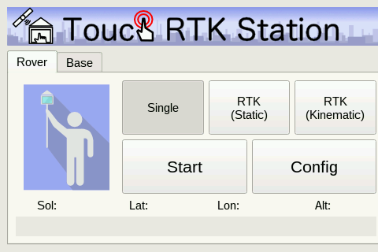 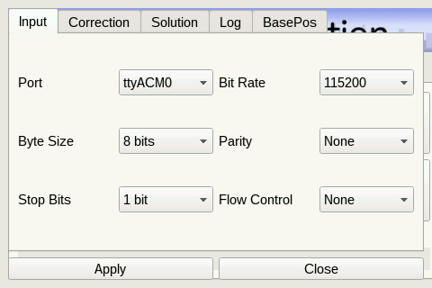
1. Single(単独測位)，RTK(Static)，RTK(Kinematic)のどれかを選択<p>
2. Configを押す．Inputタブは基本的にはDefaultのまま．Solution/Logタブで保存先を指定．デフォルトはUSBメモリ．
3. RTKの場合は，Correctionタブで補正データのストリームを設定．さらに，基準局のBasePosタブで基準局の座標を入力．<p>
4. Startで移動局モード開始．測位結果が表示される（エフェメリスのデコードが必要なため30秒程度待つ必要がある）．<p>
5. Stopで終了．Rawデータ，Posデータが保存されている．

### Base (基準局)
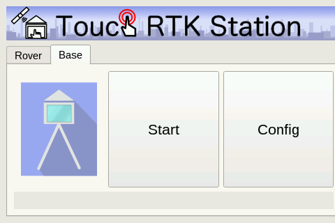 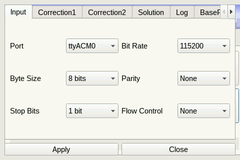
1. Baseタブを選択<p>
2. Configを押す．Inputタブは基本的にはDefaultのまま．Logタブで保存先を指定．デフォルトはUSBメモリ．<p>
3. 補正データを配信する場合Outputタブで補正データのストリームを設定（要ネットワーク接続）．Zigbeeなどを利用する場合には，Output2タブでシリアルポートを設定する．RTCM形式で配信する場合には，BasePosタブで基準局の座標を入力．<p>
4. Startで基準局モード開始．GNSSデータの配信/保存が始まる．<p>
5. Stopで終了（数秒待つ）．Rawデータが保存されている．

## 各種設定の変更の仕方
### Config画面のデフォルト値の変更
TouchRTKStation.pyのL18~L88を直接編集してください．
```python
# ublox command file for Base mode
ubxcmd = dirtrs+'/conf/ubx_m8t_bds_raw_1hz.cmd'

# Default Base position configuration
basepos_type=(['LLH','RTCM'])
basepos_itype=0
basepos_lat='35.0'
basepos_lon='139.0'
basepos_hgt='50.0'

# Default Input stream configuration
input_port = (['serial0','serial1','ttyACM0','ttyACM1','ttyUSB0','ttyUSB1'])
input_bitrate = (['300','600','1200','2400','4800','9600','19200','38400','57600','115200','230400'])
input_bytesize = (['7 bits','8 bits'])   #[7 8]
input_parity = (['None','Even','Odd'])   #[n e o]
input_stopbits = (['1 bit','2 bits'])    #[1 2]
input_flowcontrol = (['None','RTS/CTS']) #[off rtscts]
input_iport=2
input_ibitrate = 9
input_ibytesize = 1
input_iparity = 0
input_istopbits = 0
input_iflowcontrol = 0

# Default Correction stream configuration
corr_flag = False
corr_type=(['NTRIP Client','TCP Client'])
corr_itype=0
corr_format=(['RTCM2','RTCM3','BINEX','UBX'])
corr_iformat=1
corr_user = 'user'
corr_addr = 'test.net'
corr_port = '2101'
corr_pw = 'password'
corr_mp = 'RTCM'

# Default Log/Solution stream configuration
log_flag = True
sol_flag = True
dir = glob.glob('/media/*/*/')
if len(dir)==0:
    dir = [dirtrs+'/']
sol_filename = dir[0]+'%Y-%m%d-%h%M%S.pos'
log_filename = dir[0]+'%Y-%m%d-%h%M%S.ubx'

# Default Output stream configuration
output_flag = False
output_type=(['TCP Server','NTRIP Server','NTRIP Caster'])
output_itype=1
output_format=(['UBX','RTCM3'])
output_iformat=0
output_user = 'user'
output_addr = 'test.net'
output_port = '2101'
output_pw = 'password'
output_mp = 'TRS'

# Default Output(Serial) stream configuration
output2_flag = False
output2_port = (['serial0','serial1','ttyACM0','ttyACM1','ttyUSB0','ttyUSB1'])
output2_bitrate = (['300','600','1200','2400','4800','9600','19200','38400','57600','115200','230400'])
output2_bytesize = (['7 bits','8 bits'])   #[7 8]
output2_parity = (['None','Even','Odd'])   #[n e o]
output2_stopbits = (['1 bit','2 bits'])    #[1 2]
output2_flowcontrol = (['None','RTS/CTS']) #[off rtscts]
output2_iport=4
output2_ibitrate = 9
output2_ibytesize = 1
output2_iparity = 0
output2_istopbits = 0
output2_iflowcontrol = 0
```
### Roverの測位に関するパラメータの変更
RTKLIBの.confファイルを直接編集して下さい．  
confファイルは下記のディレクトリに入っています．  
  `$ cd /home/pi/TouchRTKStation/conf/`
* 単独測位: `/home/pi/TouchRTKStation/conf/single.conf`
* RTK測位(Kinematic): `/home/pi/TouchRTKStation/conf/kinematic.conf`
* RTK測位(Static): `/home/pi/TouchRTKStation/conf/static.conf`
